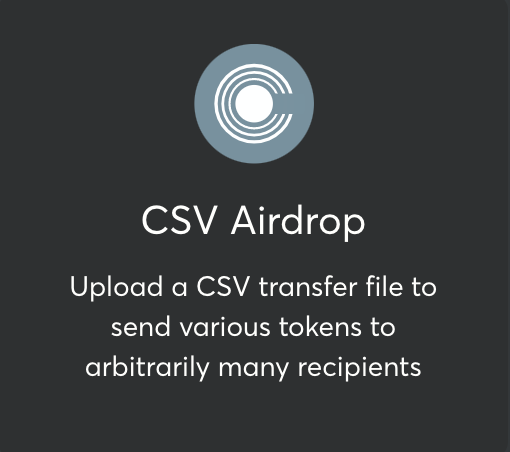
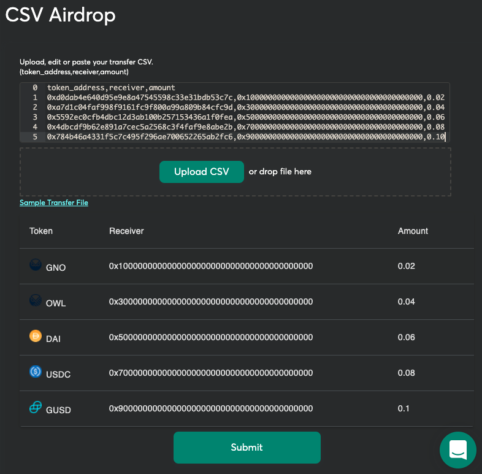

# CSV Airdrop; A Safe App for Easy Transfers

Have you encountered the painful task of sending out multiple token transfers to several recipients with various different values?
Not only do you have to have to initiate multiple transactions, but then each transaction requires a signature threshold followed by the time it takes to have each transaction mined...
Well these days are over!
Finally a Safe App which allows you to transfer various ERC20 tokens to arbitrarily many recipients for varying amounts in a single Ethereum transaction.
Its as simple as uploading a CSV "transfer" file and submitting a single transaction.

In this article, we demonstrate how to use the Gnosis Safe - CSV Airdrop

## Preparing a Transfer File

Transfer files are expected to be in CSV format with the following minimally required columns:

- _receiver_: Ethereum address of transfer receiver.
- _token_address_: Ethereum address of ERC20 token to be transferred.
- _amount_: the amount of token to be transferred.

An example transfer file would look as follows:

```
token_address,receiver,amount
0xd0dab4e640d95e9e8a47545598c33e31bdb53c7c,0x1000000000000000000000000000000000000000,0.02
0xa7d1c04faf998f9161fc9f800a99a809b84cfc9d,0x3000000000000000000000000000000000000000,0.04
0x5592ec0cfb4dbc12d3ab100b257153436a1f0fea,0x5000000000000000000000000000000000000000,0.06
0x4dbcdf9b62e891a7cec5a2568c3f4faf9e8abe2b,0x7000000000000000000000000000000000000000,0.08
0x784b46a4331f5c7c495f296ae700652265ab2fc6,0x9000000000000000000000000000000000000000,0.10
```

Here we have 5 transfers, each for a different token, going to a different receiver and for different amounts. On the rinkeby network, these tokens are GNO, OWL, DAI, USDC and GUSD respectively.

## Native Token Transfers

Since native tokens do not have a token address, you must leave the `token_address` column blank for native transfers. An example transfer file containing only native transfers is [here](test_data/native-token.csv). Of course, these files can be mixed as follows;

```
token_address,receiver,amount
0xe91D153E0b41518A2Ce8Dd3D7944Fa863463a97d,0x206a9EAa7d0f9637c905F2Bf86aCaB363Abb418c,1
,0x7f01D9b227593E033bf8d6FC86e634d27aa85568,0.0002
```

which (on xdai) represents a transfer for 1 wxDai and 0.0002 native xDai.

## Initializing your Transaction

Navigate to the APPS page from within your [Gnosis Safe MultiSig](http://gnosis-safe.io/app). If you don't already have a Safe, you can create one for free!

1. Open up the CSV Airdrop App, which looks like this:



2. Upload your _Transfer File_ and verify that the tokens, recipients and amounts are displayed as expected.



3. Click Submit, execute and wait for your transaction to be mined.


A successful transaction will look like the following [example on etherscan](https://rinkeby.etherscan.io/tx/0x25c1a799957161a18a20056ffde5edf53dc426adc231d5fa456111e3eb641e59):


